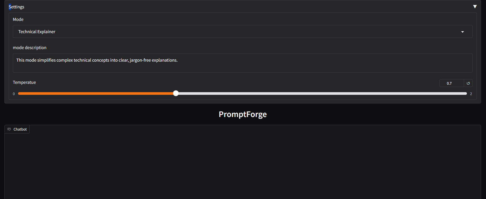
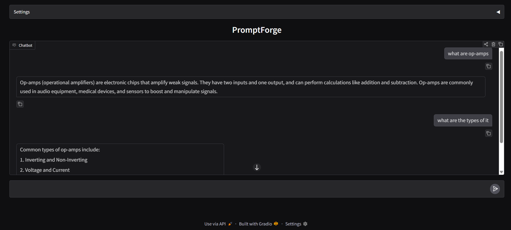
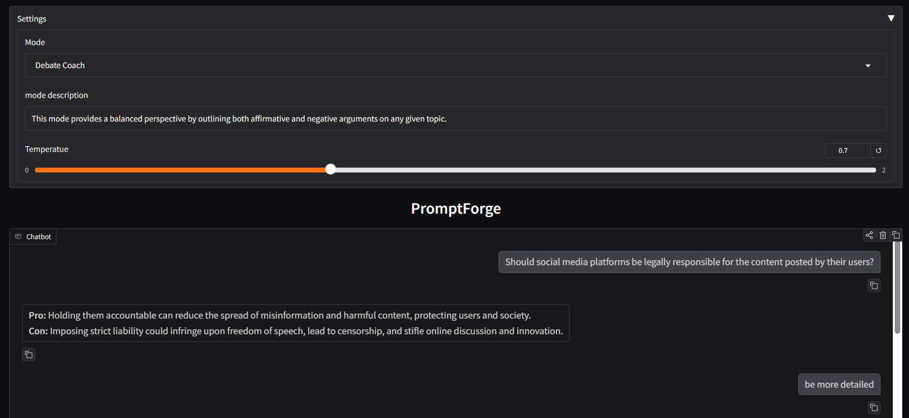
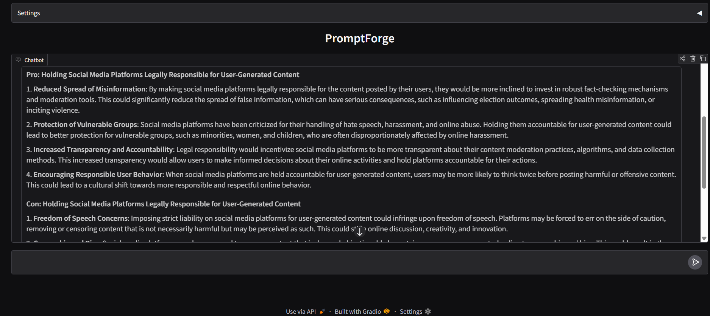
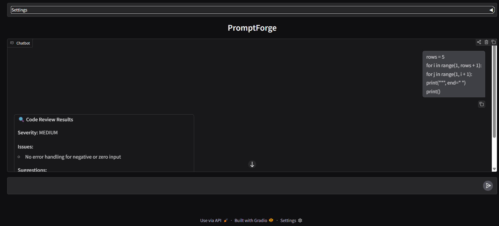
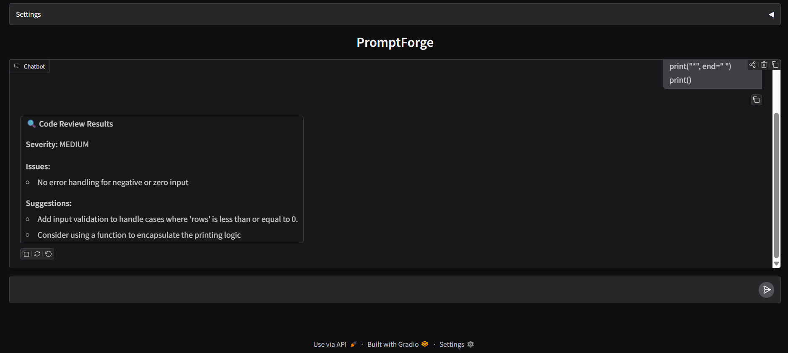
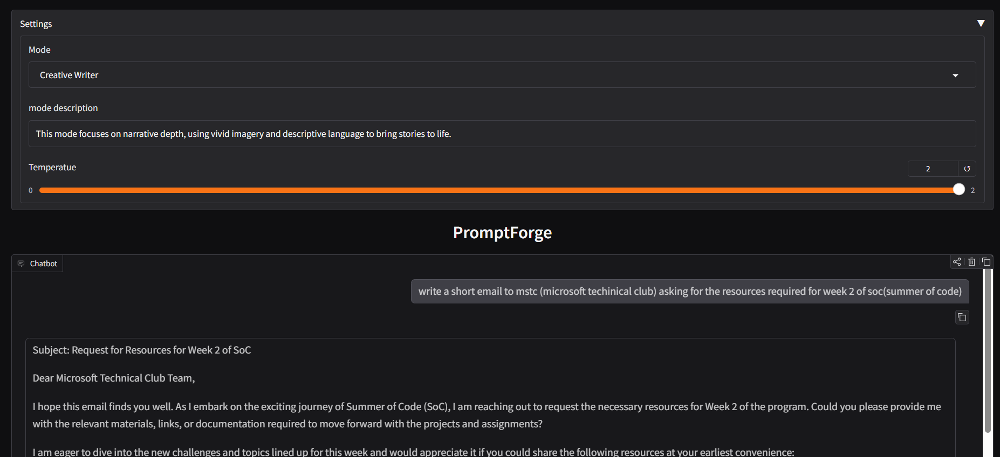
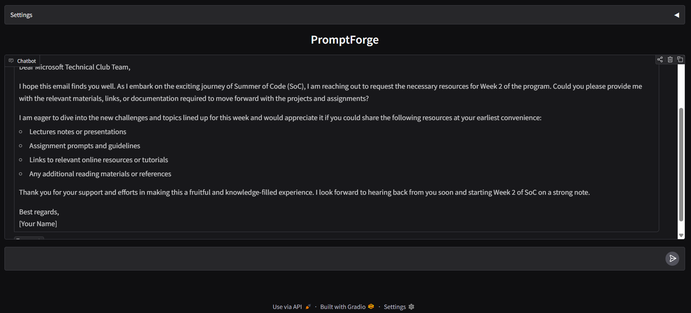

# PromptForge

A Gradio app with 4 selectable AI personas, each with a different system prompt, few-shot examples, and output style. Pick a mode, type a prompt, and get a response styled for that mode — with streaming text appearing token by token.

---

## The 4 Modes

### 🧠 Technical Explainer
Explains complex concepts clearly to undergraduates, avoiding unnecessary jargon. Responses are kept under 100 words.  

below are some screenshots  

screenshot 1:  

screenshot 2:

### ⚖️ Debate Coach
For any topic, presents the strongest arguments for both the Pro and Con sides objectively.  

below are some screenshots  

screenshot 1:  

screenshot 2:


### 🔍 Code Reviewer
Identifies bugs and suggests improvements. Returns structured output in this format:
```json
{"issues": [], "suggestions": [], "severity": "low|medium|high"}
```
Rendered as a formatted Markdown report in the UI.  

below are some screenshots  

screenshot 1:  

screenshot 2:


### ✍️ Creative Writer
Uses a vivid, descriptive, and narrative style with sensory details.  

below are some screenshots  

screenshot 1:  

screenshot 2:


---

## Running Locally

### 1. Clone the repo

```bash
git clone https://github.com/<your-username>/genai-soc-2026.git
cd genai-soc-2026/week1-promptforge
```

### 2. Create and activate a virtual environment

```bash
python -m venv venv
source venv/bin/activate      # macOS/Linux
venv\Scripts\activate         # Windows
```

### 3. Install dependencies

```bash
pip install groq gradio python-dotenv
```

### 4. Set up environment variables

```bash
cp .env.example .env
```

Fill in your Groq API key in `.env`.

### 5. Run

```bash
python app.py
```

---

## Environment Variables

| Variable       | Description              | Required |
|----------------|--------------------------|----------|
| `GROQ_API_KEY` | Your Groq API key        | ✅ Yes   |

Copy `.env.example` to `.env` and fill in your key. Never commit your `.env` file.

---

## Settings

- **Mode** — dropdown to select one of the 4 personas
- **Temperature** — slider from 0.0 to 2.0 (step 0.1, default 0.7)

Switching modes clears the conversation history automatically.

---

## Model

`llama-3.3-70b-versatile` via the Groq API. Streaming is enabled for all modes except Code Reviewer.
